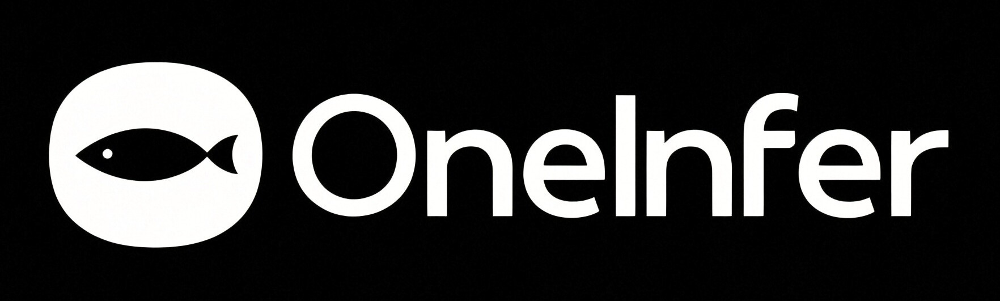
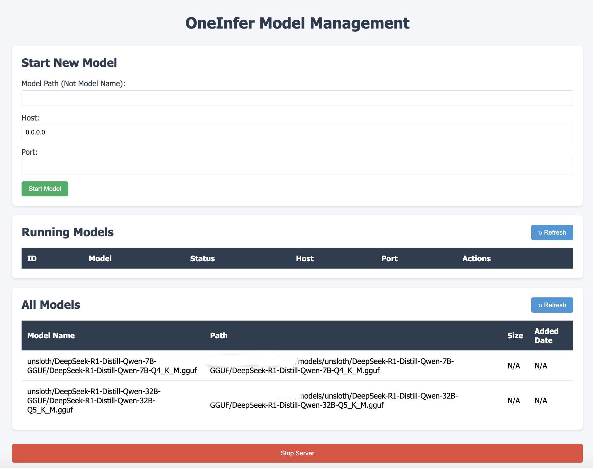

# OneInfer 

Inference model all in one. Easily Large Model Inference on Your Local Machine.

A lightweight CLI tool that simplifies deploying and managing machine learning models locally. Designed for seamless integration of popular model sources (Hugging Face Hub, ModelScope, local files) with optimized CPU/GPU execution via llama.cpp backend (more backends coming soon).

[中文文档](./readme_zh.md)

## Difference from Ollama

Compared to Ollama, OneInfer offers more flexibility and choices:

1. **Broader model platform support**: OneInfer supports downloading models from multiple platforms, including Hugging Face and ModelScope, whereas Ollama is limited to its platform.
2. **Support for diverse inference backends**: OneInfer will support various inference backends, not only for language models but also for visual models and other non-LLM models, providing users with more options and freedom.

With OneInfer, users can enjoy the convenience of portable local deployment while benefiting from more platform and model choices, offering a richer and more flexible experience.

## Roadmap
- [x] Ollama-like model management
- [x] Using any pre-trained models from Hugging Face or ModelScope
- [x] Support for serving LLM models using `llama.cpp` (.gguf models)
- [x] Web UI
- [x] Ready-to-use packaged application, allowing users to download and use it immediately without the need for compilation.
- [ ] More inference backends to be supported
- [ ] More types of models to be supported

## Requirements
- Python3 for downloading models from Hugging Face and ModelScope.
- Go 1.18+ for building oneinfer.
- git for downloading other repos.

## Install pre-built Package
Checkout https://github.com/derekwin/OneInfer/releases and install oneinfer by following the instructions provided.

## Build and Install
To build and install OneInfer:

1. Clone the repository:
   ```bash
   git clone https://github.com/derekwin/oneinfer.git
   cd oneinfer
   ```
2. Run the `make` command:
   ```bash
   make USE_CUDA=1
   ```

   for different GPU/backend:
   - **USE_BLAS=1**: For general CPU usage.
   - **USE_CUDA=1**: For NVIDIA GPUs.
   - **USE_MUSA=1**: For Meta's AI accelerators.
   - **USE_HIP=1**: For AMD GPUs.
   - **USE_CANN=1**: For Huawei Ascend AI accelerators.
   - **USE_Vulkan=1**: For GPUs that support Vulkan, offering efficient parallel computation.
   - **USE_Metal=1**: For Apple devices.
   - **USE_SYCL=1**: For a variety of heterogeneous devices (including CPU, GPU, FPGA) using oneAPI.

3. Install/Uninstall the binary:
   ```bash
   sudo bash install.sh/uninstall.sh
   ```

or you can run `bash allinnoe.sh` directly.

## Usage

### model add
Add a model to OneInfer. This can either be from ModelScope, Hugging Face, or a local file.
(You can get repo name and file name from huggingface or modelscope website.)

```bash
oneinfer add <model_repo> <platform_name> <file_name>
```

#### Download a model from ModelScope
Example for downloading the `DeepSeek` model from ModelScope:

```bash
# deepseek r1 from unsloth
oneinfer add unsloth/DeepSeek-R1-Distill-Qwen-32B-GGUF modelscope DeepSeek-R1-Distill-Qwen-32B-Q5_K_M.gguf
oneinfer add unsloth/DeepSeek-R1-Distill-Qwen-7B-GGUF modelscope DeepSeek-R1-Distill-Qwen-7B-Q4_K_M.gguf
```

#### Download a model from Hugging Face
Example for downloading a model from Hugging Face:

```bash
oneinfer add RepoId huggingface modelname
```

#### Add a local model
Example for adding a local model file:

```bash
oneinfer add localmodelname local 
# then type file path
./test/fakemodel.bin
```

### model list
List all available models that have been added to OneInfer.

```bash
oneinfer ls
```

### model remove
Remove a specific model by its name.

```bash
oneinfer rm <model_name>
```

## Run as Server
First run OneInfer as a background server to manage model serving:

```bash
nohup oneinfer serve &
```

This will start a OneInfer server with a web UI in the background for managing model serving. Open your browser and navigate to "http://<your_server_ip>:9090" to access the web UI.



## Manage as Client

### Start a Model
Start a specific model by specifying its name. You can also define the host and port for the model server.

```bash
oneinfer run modelname [-p (default 8080)] [-H (default 127.0.0.1)]
```

For example:

```bash
oneinfer run DeepSeek-R1-Distill-Qwen-7B-Q4_K_M.gguf
```

This will call the OneInfer server and start the model server.

### Status of All Running Models
View the status of all running models:

```bash
oneinfer ps
```

This will list the currently running models along with their status.

### Stop a Model
Stop a running model by its unique identifier (UID):

```bash
oneinfer stop <model_uid>
```

### Stop the Server
Stop the entire OneInfer server:

```bash
oneinfer stop serve
```

This will stop the server and all running models.

---

## Troubleshooting

- If you encounter any issues with model downloads, ensure that Python 3 is installed and working properly for the ModelScope and Hugging Face integrations.
- If a model cannot be started, check if the port is already in use or if any dependency is missing.

For detailed help on each command, use the `--help` flag:
```bash
oneinfer --help
```

---

## License
OneInfer is open-source software licensed under the MIT license.
